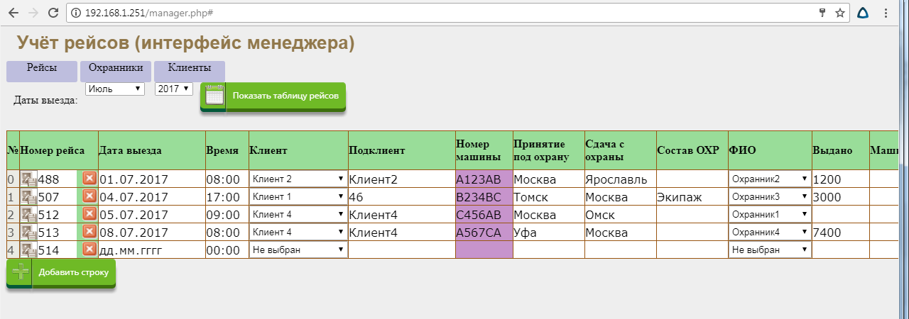
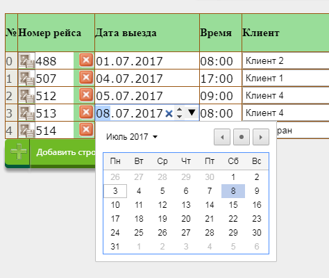
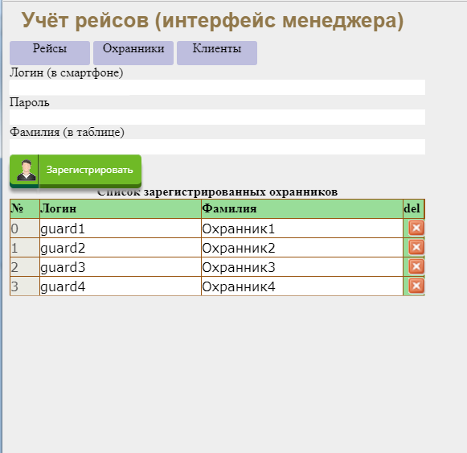
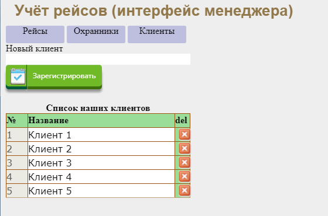

## Описание
Сервис для учёта рейсов автоперевозок. Менеджер заносит в базу рейсы (заказчик, время отправления, стоимость, время простоя и т.д.) и распределяет, кому из охранников какой рейс достанется. После завершения рейса автоматически подсчитывается его цена, с учётом возможного простоя и неустоек. Охранник со своей стороны имеет возможность принять рейс в работу, ввести номер автомашины, время отправления и завершения рейса, а так же фотографии (экипажа и пломб).

## Для чего это
Сервис сделан ради улучшения контроля за охраной грузов фирмой, осуществляющей услуги по охране. До его внедрения охранники перед выездом инструктировались устно, а при отправлении и по завершении рейса отзванивались дежурному, который вносил информацию в табель рейсов врчную. На основе этого табеля менеджер в экселе рассчитывал сроки доставки, неустойки и прочие финансы. Фиксация пломб на кузовах автотранспорта велась так же вручную. Сервис позволил автоматизировать эту работу.

## Инсталляция
Скопировать файлы на хостинг, импортировать БД, переименовать config-example.ini в cofig.ini и задать в нём параметры доступа к БД: hostname, username, password, dbName.

## Скриншоты
Интерфейс менеджера  

Изменеие даты рейса  

Список охранников  

Список фирм клиентов  

Галерея фотографий с рейса  

Интерфейс охранника (выбор дня, на котором есть рейсы)  

